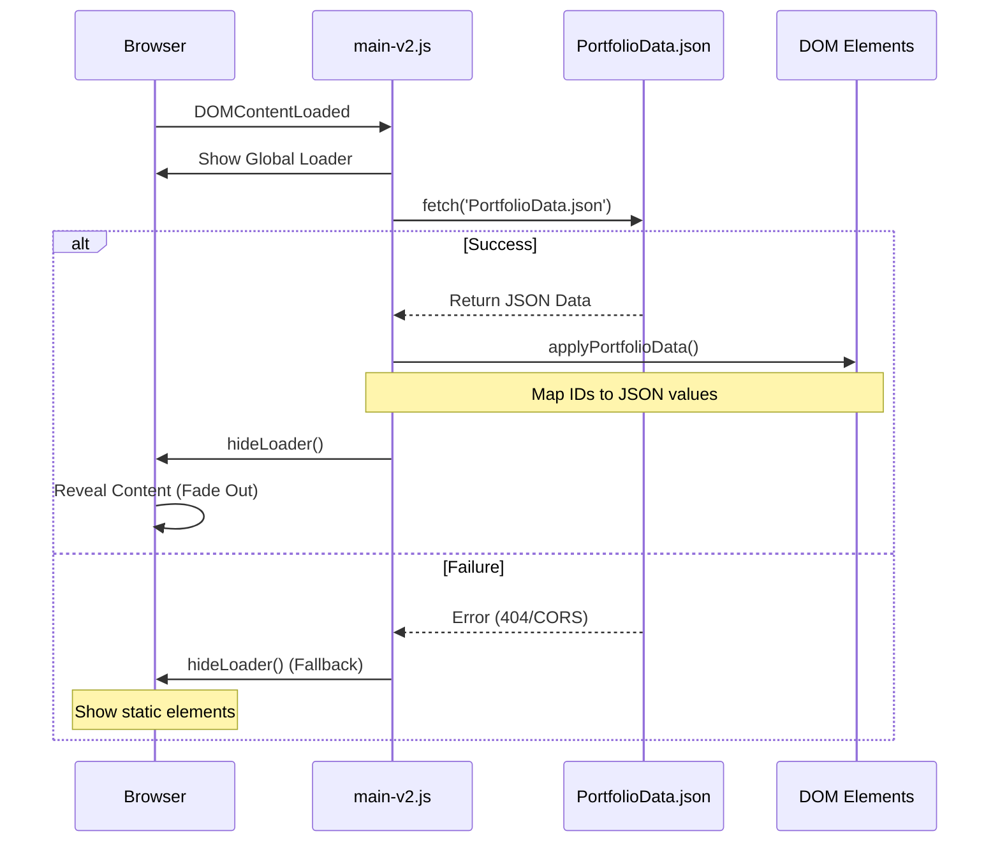

# 🚀 Modern Portfolio

A premium, high-performance portfolio website built with a data-driven architecture. This project focuses on speed, maintainability, and advanced visual aesthetics.

## 🛠️ Technologies
- **Core**: Semantic HTML5 & Vanilla JavaScript (ES6+).
- **Styling**: Modern CSS3 with Vanilla variables, Glassmorphism, and complex keyframe animations.
- **Architecture**: Data-driven UI via externalized **JSON** configuration.
- **Interactions**: Intersection Observer API for scroll-triggered reveals and dynamic navigation tracking.
- **Design**: Premium Dark Mode, 3D Avatar integration, and smooth UI transitions.

## 📦 Getting Started

### Prerequisites
You need [Node.js](https://nodejs.org/) installed to use `npx`.

### Launching Locally
To avoid **CORS** issues while fetching the data from the JSON file, the project must be served through a local server.

Run the following command in the root directory:
```bash
npx http-server .
```
Then open the provided local URL (usually `http://localhost:8080`) in your browser.

## 📂 Project Structure

- `index.html`: Core structure and SEO-optimized semantic markup.
- `PortfolioData.json`: **The single source of truth** for all portfolio content.
- `js-v2/main-v2.js`: Logic for data fetching, DOM population, and complex scroll animations.
- `css-v2/styles-v2.css`: Premium design tokens and component styling.
- `images/`: Optimized assets (logos, avatars, and maps).

## ⚙️ Content Management (`PortfolioData.json`)

All text content is externalized to ensure the portfolio is easy to update without touching the code. To update your info:

1. Open `PortfolioData.json`.
2. Modify the values for `hero`, `about`, `works`, `skills`, or `contact`.
3. Refresh the browser to see changes instantly.

The system includes a **Global Loading Screen** that ensures all data is fully loaded and applied before revealing the page to the user, providing a professional and seamless experience.

## 🚀 Portfolio link

## 🛠️ Technical Implementation: JSON Data Loading

The portfolio uses an asynchronous, data-driven approach to populate content:



1.  **Asynchronous Fetching**: Upon page load, a `fetch()` request is sent to retrieve `PortfolioData.json`. This is wrapped in an `async/await` function to handle the asynchronous nature of network requests.
2.  **Dynamic DOM Population**: A helper function `setElText(id, text)` safely updates the `textContent` of elements only if they exist in the DOM, preventing script errors.
3.  **Loading Orchestration**: The **Global Loader** is synchronized with the data fetching process. It remains visible until the JSON is successfully parsed and the DOM is fully populated.
4.  **Error Handling**: The implementation includes robust error boundaries. If the fetch fails (e.g., due to a 404 or CORS issue), the loader still hides to allow the user to see the site, and detailed debug information is logged to the console.

---
*Created with ❤️ Ny Harena *
