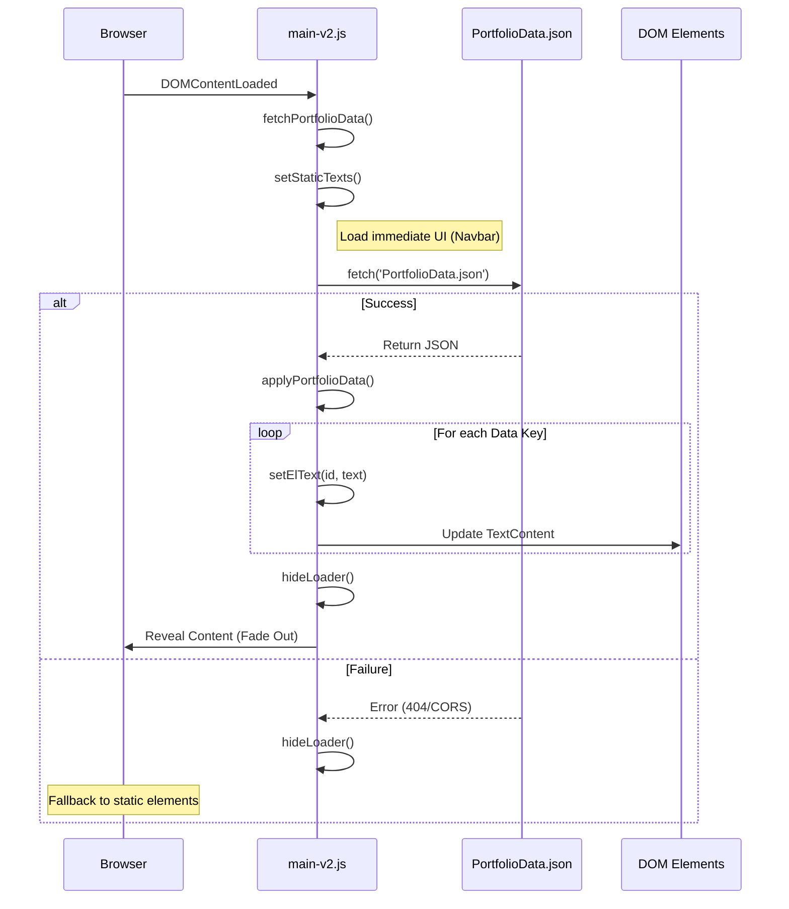

# 🚀 Modern Portfolio

A premium, high-performance portfolio website built with a data-driven architecture. This project focuses on speed, maintainability, and advanced visual aesthetics.

## 🛠️ Technologies

| 🏗️ Core | 🎨 Styling | 🧠 Logic | 📊 Data |
| :--- | :--- | :--- | :--- |
| **HTML5**<br>Semantic structure for high-end SEO & accessibility. | **Modern CSS3**<br>Vanilla variables, Glassmorphism & Keyframe animations. | **JavaScript ES6+**<br>Asynchronous fetching & Intersection Observer API. | **JSON Storage**<br>Externalized data for easy & dynamic content updates. |

## 📦 Getting Started

### Prerequisites
You need [Node.js](https://nodejs.org/) installed to use `npx`.

### Launching Locally
To avoid **CORS** issues while fetching the data from the JSON file, the project must be served through a local server.

Run the following command in the root directory:
```bash
npx http-server .
```
Then open the provided local URL (usually `http://localhost:8080`) in your browser.

## 📂 Project Structure

```text
.
├── index.html              # Main entrance and semantic structure
├── index.old.html          # Legacy version kept for reference
├── PortfolioData.json      # Central data repository (Single source of truth)
├── README.md               # Documentation and setup guide
├── css-v2/
│   └── styles-v2.css       # Premium design tokens & modern animations
├── js-v2/
│   └── main-v2.js          # Logic: data fetching, DOM mapping, scroll effects
├── images/                 # Optimized visual assets (Logos, 3D Avatars)
└── doc/
    └── cv-v2.pdf           # Professional Resume/CV
```

## ⚙️ Content Management (`PortfolioData.json`)

All text content is externalized to ensure the portfolio is easy to update without touching the code. To update your info:

1. Open `PortfolioData.json`.
2. Modify the values for `hero`, `about`, `works`, `skills`, or `contact`.
3. Refresh the browser to see changes instantly.

The system includes a **Global Loading Screen** that ensures all data is fully loaded and applied before revealing the page to the user, providing a professional and seamless experience.

## 🚀 Portfolio link

## 🛠️ Technical Implementation: JSON Data Loading

The portfolio uses an asynchronous, data-driven approach to populate content:



1.  **Asynchronous Fetching**: Upon page load, a `fetch()` request is sent to retrieve `PortfolioData.json`. This is wrapped in an `async/await` function to handle the asynchronous nature of network requests.
2.  **Dynamic DOM Population**: A helper function `setElText(id, text)` safely updates the `textContent` of elements only if they exist in the DOM, preventing script errors.
3.  **Loading Orchestration**: The **Global Loader** is synchronized with the data fetching process. It remains visible until the JSON is successfully parsed and the DOM is fully populated.
4.  **Error Handling**: The implementation includes robust error boundaries. If the fetch fails (e.g., due to a 404 or CORS issue), the loader still hides to allow the user to see the site, and detailed debug information is logged to the console.

---
*Created with ❤️ Ny Harena *
